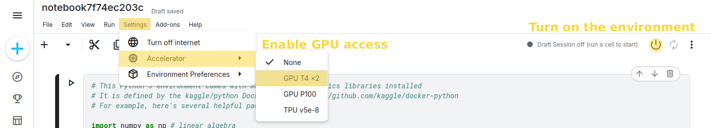

# A practical introduction to large language models

This repository contains the Jupyter notebooks used in the practical part of a hands-on workshop providing an introduction 
to large language models.

## Navigating the repository
The repository contains the following notebooks.  
**TODO once we have this finalized, put them in order and describe them in ~1 sentence.**  
*llm_machine_translation.ipynb*: ...  
*openai-api.ipynb*: ...  
*llm-sentiment-classification.ipynb*: ...  
*faster-inference-vllm.ipynb*: ...  

## Preparing the environment

The notebooks can be ran online using a Jupyter Notebook environment such as 
[Kaggle Notebook Editor](https://www.kaggle.com/code) or [Google Colab](https://colab.research.google.com/). 
These environments provide free access to GPUs and do not require any installation locally on your computer. 
Below are the instructions to set up the notebooks using the Kaggle environment.

*Note that you may also run these notebooks locally by installing Jupyter Notebook, but you will need to handle access to a GPU 
yourself (and potentially minimally adapt the code).*

1. [Register](https://www.kaggle.com/account/login?phase=startRegisterTab) on Kaggle and sign in into your account.
2. In the sidebar menu click on [Your Work](https://www.kaggle.com/work).
3. Create a new notebook via **Create**->**New Notebook**. This will set up an empty notebook with dummy code in it.
4. Import one of the notebooks from this repository via **File**->**Import Notebook**. Choose the option *GitHub* and 
search for *azagsam/slaif-dh-workshop*. Finally, select the desired notebook in the File dropdown menu. 
After a few moments, the content of the notebook should load. 
5. As we will be working with LLMs using GPUs, we need to enable GPU access on Kaggle. Do so via **Settings**->
**Accelerator**->**GPU T4 x2**. This will show you the details on resource availability - confirm your choice by 
clicking **Turn on GPU T4 x2**.
6. Finally, turn on the environment by clicking on the power button.

